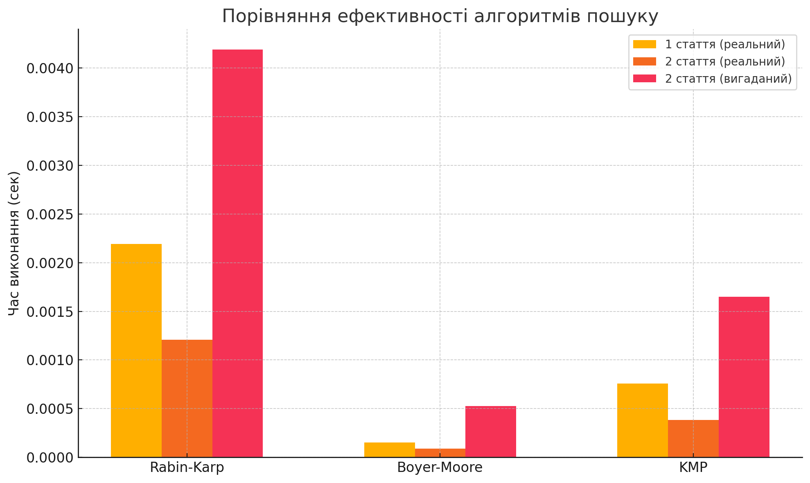

# 🔍 Порівняння алгоритмів пошуку підрядка

У цьому проєкті порівнюються три класичних алгоритми пошуку підрядків:

- **Rabin-Karp**
- **Boyer-Moore**
- **Knuth-Morris-Pratt (KMP)**

Дослідження проводиться на основі двох текстових файлів (стаття 1 та стаття 2) із використанням бібліотеки `timeit` для вимірювання часу виконання пошуку.

---

## ⚙️ Алгоритми та тести

Для кожного з текстів були протестовані два типи підрядків:

- **реальний** — підрядок, що дійсно зустрічається в тексті
- **вигаданий** — підрядок, що не зустрічається в тексті

---

## ⏱️ Результати тестування

| Стаття       | Алгоритм    | Реальний (сек) | Вигаданий (сек) |
| ------------ | ----------- | -------------- | --------------- |
| **1 стаття** | Rabin-Karp  | 0.002193       | —               |
|              | Boyer-Moore | 0.000152       | —               |
|              | KMP         | 0.000758       | —               |
| **2 стаття** | Rabin-Karp  | 0.001207       | 0.004192        |
|              | Boyer-Moore | 0.000089       | 0.000526        |
|              | KMP         | 0.000385       | 0.001650        |

---

## 📊 Візуалізація результатів

---

## 📌 Висновки

- ✅ Найшвидший для **першої статті**: **Boyer-Moore** (0.000152 сек)
- ✅ Найшвидший для **другої статті (реальний підрядок)**: **Boyer-Moore** (0.000089 сек)
- ✅ Найшвидший для **другої статті (вигаданий підрядок)**: **Boyer-Moore** (0.000526 сек)
- 🏆 **Загальний переможець**: **Boyer-Moore**  
  (середній час виконання: ~**0.000255 сек**)

---

## 📁 Файли

- `main.py` — основна логіка тестування
- `substring_search_comparison.png` — графік з результатами
- `README.md` — цей опис

---

## 📌 Примітки

- Тексти завантажуються через [Google Drive](https://drive.google.com)
- Код написано з використанням Python 3.10+
